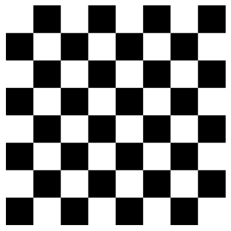
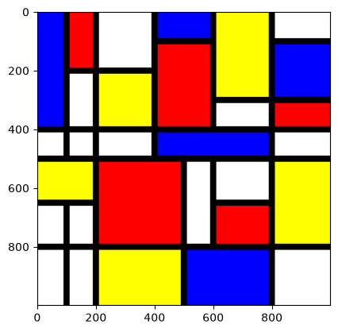
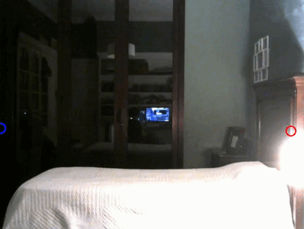

# Práctica 1
## Índice

- [Ajedrez](#ajedrez)
- [Mondrian](#mondrian)
- [Píxel más claro y oscuro](#píxel-más-claro-y-oscuro)
- [Pop art](#pop-art)

## Ajedrez

### Versión sin IA:

En esta tarea se ha realizado un tablero de ajedrez utilizando una medida de 800 de largo y 800 de ancho, teniendo cada casilla un tamaño de 100x100. Una vez establecida la medida se procede con el método que crea una matriz de ceros con dicha medida:  
  
```
np.zeros((medida,medida,1), dtype = np.uint8)
```  
  
Al ser creadas con ceros nos aseguramos que toda la imagen tenga un color negro y lo que se hará a continuación será rellenar con cuadrados blancos de tamaño 100x100 en los huecos correspondientes, "ahorrando" pintar los cuadrados negros al ser el fondo de dicho color.  
Recorremos la imagen mediante 2 bucles **for** con rango 8 cada uno (8x8= 64 casillas del tablero) buscando las posiciones en donde **i+j** es par y pintando estas de color blanco, asignando el valor 255:  

```
img_tarea[100*i:100*(i+1),100*j:100*(j+1)] = 255
```
  
Los rangos utilizados permiten seleccionar un área de 100 × 100 píxeles para cada casilla. Finalmente, se muestra la imagen utilizando una escala de grises en donde el valor mínimo establecido será 0 y el máximo 255. De este modo el valor 0 sería el negro y el valor 255 el blanco:  
  
```
plt.imshow(img_tarea, cmap='gray',vmin=0, vmax=255)
plt.show()
```

**Tablero de Ajedrez sin IA:**  

<br> 
  <p align="center">
    
  </p>
<br>

### Versión con IA:

A diferencia de la versión sin IA, esta ha optado por crear una imagen inicial blanca en vez de negra por lo que la única diferencia es la condición de los bucles. Esta condición es lo contrario a la versión sin IA. Trata de buscar las sumas de los índices (fila + columna) que son igual a 1, es decir, las que son impares:  

```
if (fila + columna) % 2 == 1
```

Una vez encontrada dicha suma, se procede a pintar un cuadrado negro de tamaño 100x100 a partir de los índices de la iteración:  

```
tablero[fila * casilla:(fila + 1) * casilla, columna * casilla:(columna + 1) * casilla] = 0
```  

**Tablero de Ajedrez con IA:**  

<br> 
  <p align="center">
    
  </p>
<br>

## Mondrian

Primero se crea una imagen con fondo blanco:

```
imagen_mondrian = np.ones((alto,ancho,3), dtype = np.uint8) * 255
```  

Seguido de esto, se dibujan las líneas verticales y horizontales:

```
cv2.line(imagen_mondrian,(100,0),(100,500),(0,0,0),20)
...
```

Y por último se dibujan los rectángulos dentro de los huecos formados por las líneas verticales y horizontales:

```
cv2.rectangle(imagen_mondrian,(0,500),(200,650),(255,255,0),-1)
...
```

<br> 
  <p align="center">
    
  </p>
<br>

## Píxel más claro y oscuro

Se ha utilizado la cámara del dispositivo para analizar cada fotograma. Para comenzar, se inicializa la captura de vídeo mediante:  

```
vid = cv2.VideoCapture(0)
```

Posteriormente, mediante un bucle while, se capturan los fotogramas de la cámara y se obtiene su alto y ancho para poder recorrer todos los píxeles.

Para encontrar los píxeles más claro y más oscuro se utilizan dos bucles for, recorriendo todos los píxeles fotograma. Para determinar la claridad de cada píxel se suman los valores de sus tres canales de color:

```
claridad = int(pixel[0]) + int(pixel[1]) + int(pixel[2])
```

Es importante pasar los valores BGR al tipo int para que el máximo de la suma no sea 255 sino que sea 765. Una vez obtenida la suma, se compara la claridad de cada píxel con los valores almacenados anteriormente. Si el valor es mayor que "Mas_claro", se actualizan las coordenadas del píxel más claro. Del mismo modo, si es menor que "Mas_oscuro", se actualizan las coordenadas del píxel más oscuro.

Una vez encontrados ambos píxeles, se marcan sus posiciones mediante dos círculos:

```
cv2.circle(frame, (x_claro, y_claro), 10, (0, 0, 255), 2)
cv2.circle(frame, (x_oscuro, y_oscuro), 10, (255, 0, 0), 2)
```

Finalmente, se muestra el fotograma con las posiciones marcadas y el programa continúa realizando el proceso hasta que se pulsa la tecla ESC.

<br>

<p align="center">
  
</p>

<br>

Se puede observar que el círculo rojo detecta una única zona con la claridad más alto. Por otro lado, el círculo azul detecta muchas zonas con la claridad mas baja posible (755) y por eso cada vez que se muestra un fotograma este círculo aparece en posiciones diferentes.

El programa funciona "a saltos" debido a la gran cantidad de cálculos que debe hacer. Esto ocurre porque la camara captura un video de tamaño 480x640 lo que da un total de 307200 pixeles por fotograma y, para cada píxel, calcula la intensidad y lo compara con las intensidades mas claras y oscuras.

Una manera de acelerar el proceso podría ser disminuir el número de píxeles que se recorren en los bucles "for" a la mitad.

## Pop art

Para esta tarea hemos cogido la inspiración de la famosa interpretación de Andy Warhol de Marilyn Monroe y en fotos encontramos el popart de Obama conocido cono "hope" e intentamos recrearlo según la escala de grises.
